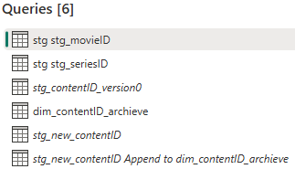
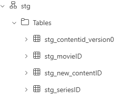
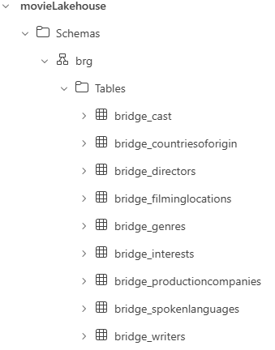
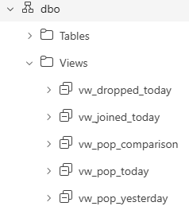

📌 IMDb Fabric Analytics Pipeline
Microsoft Fabric • Lakehouse • Delta • Dataflows Gen2 • Pipelines • Power BI

Bu proje, IMDb popüler film ve dizi verilerini başından sonuna tamamen otomatik işleyen, Microsoft Fabric ekosistemi üzerinde tasarlanmış uçtan uca bir Modern Data Engineering projesidir.

Proje;

API’den veri toplar

Lakehouse üzerinde staging → curated (dbo) → bridge zonelerini oluşturur

Günlük trend/popularity analizlerini hesaplar

Yeni içerikleri otomatik archive edip tüm Dim & Bridge modellerini günceller

İki farklı semantic model (Gold & Trend) üzerinden

İki farklı profesyonel Power BI dashboardu besler

Tamamen modern MPP standartlarında tasarlanmış bir production-grade pipeline’dır.

🏗 Architecture Overview
High-Level Pipeline

End-to-end ingestion → processing → modeling → reporting akışının genel görünümü:

Dataflow Architecture

Power BI Dataflows Gen2 üzerinde yapılan ID extraction & transformation mimarisi:

Lakehouse Structure

Delta Lake tablolamaları: staging (stg), curated (dbo) ve bridge (brg) zone yapısı: 

     
🏗 Mimari Genel Bakış
IMDB/TMDB API  
     ⬇
Dataflow (ID Extraction)
     ⬇
Lakehouse (stg tables)
     ⬇
Notebook: Dim & Bridge Builder (overwrite)
     ⬇
Notebook: Popularity Fetcher (daily append)
     ⬇
Notebook: New Content Incremental Append
     ⬇
Delta Lakehouse (dbo & brg zones)
     ⬇
Semantic Models (Gold + Trend)
     ⬇
Power BI Dashboards (Analytics & Trend)

📌 Yüksek seviye mimari görsel:<a href="architecture/high_level_pipeline.png">
    

🧱 Lakehouse Yapısı

Lakehouse 3 ana zone ile tasarlandı:

Zone	Açıklama
stg	API’den gelen ham ID listeleri & yeni içerik ID’leri
dbo	DimContent, tarihsel içerik, popularity fact tablosu, tüm DIM tabloları
brg	Bridge tabloları (cast, genres, directors,…)
📸 Şema çizimi

  
  
  
  

🧬 Dataflow

Proje aynı Incremental Archiving Dataflow içerisinde 6 farklı Query kullanır:

İkisi stg_moviesID ve stg_SeriesID olmak üzere API'den günlük çekilen IDleri ve türleri tutan tabloları DataFlow'a çekmek için

stg_contentID_version0

Popüler ilk 100 Movie & 100 TV Series ID’lerini üst-üste append eder

stg_new_contentID

Her gün yeni eklenen (archieve'de bulunmayan) içerikleri bulur

dim_contentID_archieve

En az bir kez popüler olmuş ve API'den çektiğimiz unique Movies & Series ID'lerini tutan tabloyu DataFlow'a çekmek için

Son olarakta, stg_new_content_ID'yi dim_contentID_archieve tablosuna append eden query bulunur

📎 Tüm görseller:
/dataflows/

🧪 Notebook Görevleri
✔ 1. generate_popularity.py

IMDb → TMDB ID eşlemesi yapar

TMDB “popularity” değerlerini batch olarak çeker

Delta Lake’e günlük append eder

Popularity rank hesaplar

✔ 2. build_dim_bridge.py

IMDb API’den içerik metadata’sını çeker

DimContent’i oluşturur

Tüm DIM & BRIDGE tablolarını normalize edip overwrite eder

Spark’sız Pandas + Delta Lake uyumlu mimari

✔ 3. append_new_dimcontent.py

Sadece yeni gelen içeriklere ait DIM & BRIDGE satırlarını oluşturur

dimcontenthistorical tablosuna append eder

📎 Notebooklar:
/notebooks/popularity/
/notebooks/dim_bridge/
/notebooks/incremental/

🔃 Pipeline Mimarisi

Ana pipeline adımları:

Get Top 100 IDs

Lookup — Compare DimContentHistorical BEFORE/AFTER

Incremental Archive Dataflow

Get TMDB Popularity Notebook

Create Dim & Bridge Tables Notebook

IfCondition: New Content?

Append to Historical Notebook

Semantic Model Refresh (Gold + Trend)

📎 Pipeline görseli:
/pipelines/main_pipeline.png

🧠 Semantic Modeller

Proje iki farklı semantic model kullanır:

⭐ Gold Semantic Model

DimContent

Tüm DIM tabloları

Bridge tabloları

FactContentPopularity (latest snapshot)

IMDB Popular Movies & Series dashboard’u besler:

📸 /semantic_models/gold_model.png

🔥 Trend Semantic Model

FactContentPopularity (all history)

vw_pop_today

vw_pop_yesterday

vw_pop_comparison

vw_joined_today

vw_dropped_today

Bu model, rank trend analizleri, daily raises/drops, weekly charts üretir.

📸 /semantic_models/trend_model.png

📊 Dashboard Galerisi

Tüm dashboardlar PNG formatında eklenmiştir.

🎬 Gold Model Dashboard Seti

Cast Details – All / Movies / Series

Content Details – All / Movies / Series

Landing Page – All / Movies / Series

📎 /dashboards/gold/

📈 Trend Model Dashboard Seti

Rank & Trend Analysis Dashboard (Daily/Weekly Insights)

📎 /dashboards/trend/rankTrendLanding.png

🛠 Teknolojiler
Katman	Teknoloji
Storage	OneLake / Delta Lake
ETL	Dataflows Gen2, Notebook (Python), Pipelines
Compute	Fabric Notebook Kernel
Modeling	Power BI Semantic Models
Analytics	Power BI Dashboards
APIs	IMDb API, TMDB API
Format	Delta Tables, Parquet

🚀 Kurulum & Çalıştırma
1️⃣ Repo’yu Klonla
git clone https://github.com/oorucelik/imdb-fabric-analytics-pipeline

2️⃣ Fabric Lakehouse içinde aşağıdaki klasör yapısını oluştur

/Tables/stg/

/Tables/dbo/

/Tables/brg/

3️⃣ Dataflow’ları import et
4️⃣ Notebookları Fabric Notebook olarak upload et

(Metodu: New Notebook → Upload)

5️⃣ Pipeline içindeki aktiviteleri sırayla bağla
6️⃣ Semantic modelleri Power BI Service üzerinde oluştur

Gold

Trend

7️⃣ Dashboardları Publish et

🧭Bu proje ile:

✔ Modern Data Engineering lifecycle
✔ Lakehouse mimarisi
✔ Delta Lake & Incremental ETL
✔ API orchestrasyonu
✔ Batch işlemler & Retry mekanizmaları
✔ Data Modelleme (Star + Bridge)
✔ Semantic Model Best Practices
✔ Trend analiz mimarisi
✔ Power BI advanced UI/UX

başlıklarında uzman seviyede yetkinlik sergilersin.

🙌 Katkı & İletişim

Bu repo, Microsoft Fabric üzerinde end-to-end gerçek dünya deneyimini anlatan örnek bir projedir.
Pull request'lere ve önerilere açıktır.
