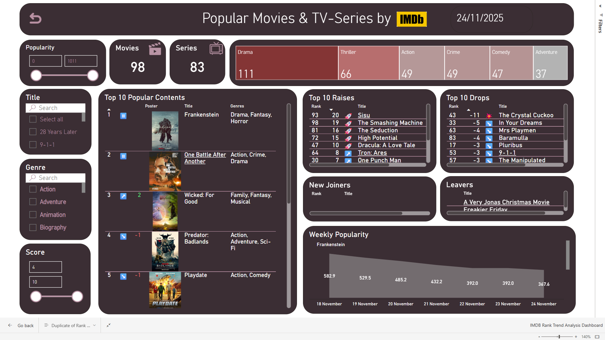

📌 IMDb Fabric Analytics Pipeline
Microsoft Fabric • Lakehouse • Delta • Dataflows Gen2 • Pipelines • Power BI
## 📚 Table of Contents
- [IMDb Fabric Analytics Pipeline](#-imdb-fabric-analytics-pipeline)
- [Architecture Overview](#-architecture-overview)
  - [High-Level Pipeline](#high-level-pipeline)
  - [Dataflow Architecture](#dataflow-architecture)
  - [Lakehouse Structure](#lakehouse-structure)
- [Mimari Genel Bakış](#-mimari-genel-bakış)
- [Lakehouse Yapısı](#-lakehouse-yapısı)
- [Dataflow](#-dataflow)
- [Notebook Görevleri](#-notebook-görevleri)
- [Pipeline Mimarisi](#-pipeline-mimarisi)
- [Semantic Modeller](#-semantic-modeller)
  - [Gold Semantic Model](#gold-semantic-model)
  - [Trend Semantic Model](#trend-semantic-model)
- [Dashboard Galerisi](#-dashboard-galerisi)
  - [Gold Model Dashboard](#gold-model-dashboard)
  - [Trend Model Dashboard](#trend-model-dashboard)
- [Teknolojiler](#-teknolojiler)
- [Kurulum & Çalıştırma](#-kurulum--çalıştırma)
- [Bu Proje ile Kazanımlar](#bu-proje-ile)
- [Katkı & İletişim](#-katkı--iletişim)

Bu proje, IMDb popüler film ve dizi verilerini başından sonuna tamamen otomatik işleyen, Microsoft Fabric ekosistemi üzerinde tasarlanmış uçtan uca bir Modern Data Engineering projesidir.

Proje;

API’den veri toplar

Lakehouse üzerinde staging → curated (dbo) → bridge zonelerini oluşturur

Günlük trend/popularity analizlerini hesaplar

Yeni içerikleri otomatik archive edip tüm Dim & Bridge modellerini günceller

İki farklı semantic model (Gold & Trend) üzerinden

İki farklı profesyonel Power BI dashboardu besler

Tamamen modern MPP standartlarında tasarlanmış bir production-grade pipeline’dır.

🏗 Architecture Overview
High-Level Pipeline

End-to-end ingestion → processing → modeling → reporting akışının genel görünümü:

Dataflow Architecture

Power BI Dataflows Gen2 üzerinde yapılan ID extraction & transformation mimarisi:

Lakehouse Structure

Delta Lake tablolamaları: staging (stg), curated (dbo) ve bridge (brg) zone yapısı: 

     
🏗 Mimari Genel Bakış

IMDB/TMDB API
    ⬇
     
Dataflow (ID Extraction)
    ⬇
     
Lakehouse (stg tables)
    ⬇
     
Notebook: Dim & Bridge Builder (overwrite)
    ⬇
     
Notebook: Popularity Fetcher (daily append)
    ⬇
     
IF(New Content) Notebook: New Content Incremental Append
     ⬇
     
Delta Lakehouse (dbo & brg zones)
     ⬇
     
Semantic Models (Gold + Trend)
     ⬇
     
Power BI Dashboards (Analytics & Trend)

📌 Yüksek seviye mimari görsel:

🧱 Lakehouse Yapısı

Lakehouse 3 ana zone ile tasarlandı:

Zone	Açıklama
stg	API’den gelen ham ID listeleri & yeni içerik ID’leri
dbo	DimContent, tarihsel içerik, popularity fact tablosu, tüm DIM tabloları
brg	Bridge tabloları (cast, genres, directors,…)
📸 Şema çizimi

  
  
  
  

🧬 Dataflow

Proje aynı Incremental Archiving Dataflow içerisinde 6 farklı Query kullanır:

İkisi stg_moviesID ve stg_SeriesID olmak üzere API'den günlük çekilen IDleri ve türleri tutan tabloları DataFlow'a çekmek için

stg_contentID_version0: Popüler ilk 100 Movie & 100 TV Series ID’lerini üst-üste append eder ve stg tablosuna lakehouseta replace eder
   
 
stg_new_contentID: Her gün yeni eklenen (archieve'de bulunmayan) içerikleri bulur ve stg tablosuna lakehouseta replace eder

dim_contentID_archieve Query'si, API'den gelen unique Movies & Series ID'lerini tutan tabloyu DataFlow'a çekmek için

Son olarakta, stg_new_content_ID Querysindeki (Archieve'de olmayan, yeni gördüğümüz film & diziler) ID'leri dim_contentID_archieve tablosuna append eden query:

🧪 Notebook Görevleri
✔ 1. generate_popularity.py

IMDb → TMDB ID eşlemesi yapar

TMDB “popularity” değerlerini batch olarak çeker

Delta Lake’e günlük append eder

Popularity rank hesaplar

✔ 2. build_dim_bridge.py

IMDb API’den içerik metadata’sını çeker

DimContent’i oluşturur

Tüm DIM & BRIDGE tablolarını normalize edip overwrite eder

Spark’sız Pandas + Delta Lake uyumlu mimari

✔ 3. append_new_dimcontent.py

Sadece yeni gelen içeriklere ait DIM & BRIDGE satırlarını oluşturur

dimcontenthistorical tablosuna append eder

📎 Notebooklar:
/notebooks/popularity/
/notebooks/dim_bridge/
/notebooks/incremental/

🔃 Pipeline Mimarisi

Ana pipeline adımları:

Get Top 100 IDs

Lookup — Compare DimContentHistorical BEFORE/AFTER

Incremental Archive Dataflow

Get TMDB Popularity Notebook

Create Dim & Bridge Tables Notebook

IfCondition: New Content?

Append to Historical Notebook

Semantic Model Refresh (Gold + Trend)

🧠 Semantic Modeller

Proje iki farklı semantic model kullanır:

⭐ Gold Semantic Model: IMDB Popular Movies & Series dashboard’u besler

DimContent

Tüm DIM tabloları

Bridge tabloları

FactContentPopularity (latest snapshot)

🔥 Trend Semantic Model: Rank trend analizleri, daily raises/drops, weekly charts üretir.

FactContentPopularity (all history)

vw_pop_today

vw_pop_yesterday

vw_pop_comparison

vw_joined_today

vw_dropped_today

📊 Dashboard Galerisi

Tüm dashboardlar PNG formatında eklenmiştir.

🎬 Gold Model Dashboard Sayfaları

  
  
  

  
  
  

  
  
  

📈 Trend Model Dashboard

Rank & Trend Analysis Dashboard (Daily/Weekly Insights)

🛠 Teknolojiler
Katman	Teknoloji
Storage	OneLake / Delta Lake
ETL	Dataflows Gen2, Notebook (Python), Pipelines
Compute	Fabric Notebook Kernel
Modeling	Power BI Semantic Models
Analytics	Power BI Dashboards
APIs	IMDb API, TMDB API
Format	Delta Tables, Parquet

🚀 Kurulum & Çalıştırma

1️⃣ Repo’yu Klonla
git clone https://github.com/oorucelik/orucinephilie-data-engineering

2️⃣ Fabric Lakehouse içinde aşağıdaki klasör yapısını oluştur

/Tables/stg/

/Tables/dbo/

/Tables/brg/

3️⃣ Dataflow’ları import et

4️⃣ Notebookları Fabric Notebook olarak upload et

(Metodu: New Notebook → Upload)

5️⃣ Pipeline içindeki aktiviteleri sırayla bağla

6️⃣ Semantic modelleri Power BI Service üzerinde oluştur

Gold

Trend

7️⃣ Dashboardları Publish et

🧭Bu proje ile:

✔ Modern Data Engineering lifecycle
✔ Lakehouse mimarisi
✔ Delta Lake & Incremental ETL

✔ API orchestrasyonu
✔ Batch işlemler & Retry mekanizmaları
✔ Data Modelleme (Star + Bridge)

✔ Semantic Model Best Practices
✔ Trend analiz mimarisi
✔ Power BI advanced UI/UX

başlıklarında uzman seviyede yetkinlik sergilersin.

🙌 Katkı & İletişim

Bu repo, Microsoft Fabric üzerinde end-to-end gerçek dünya deneyimini anlatan örnek bir projedir.
Pull request'lere ve önerilere açıktır.
